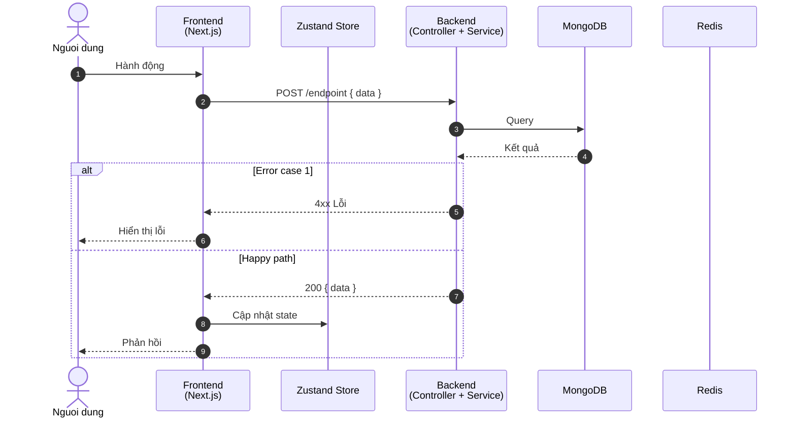
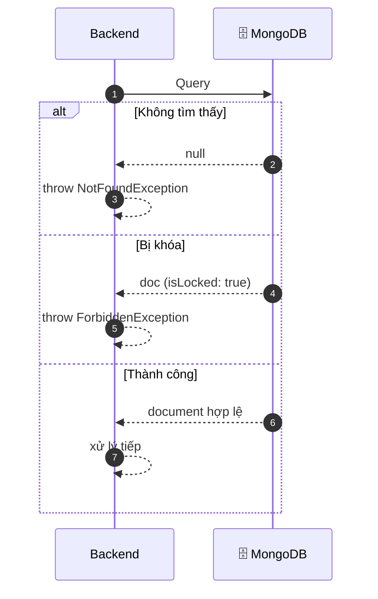
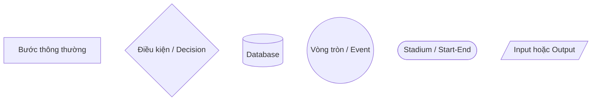
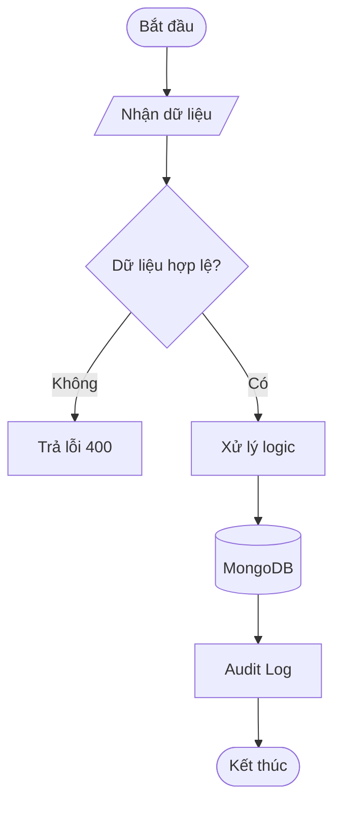
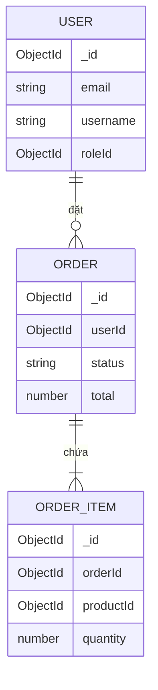
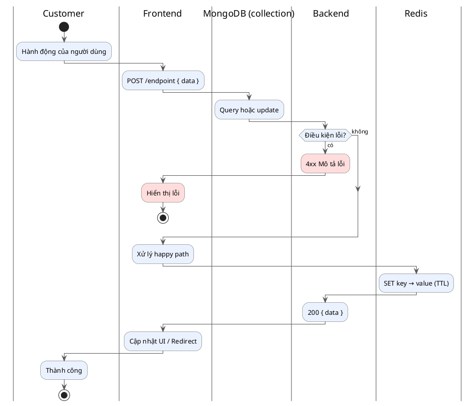

# SKILL: DaoDuckWear Diagrams – Mermaid

## TRIGGER

```
Load this skill BEFORE:
- Creating or editing any file in docs/diagrams/
- Creating .mmd or .puml files anywhere in the project
- Any task mentioning: diagram, sequence, mermaid, flowchart, ER diagram, vẽ diagram, tạo diagram
```

---

## Công cụ & Quy ước

| Quyết định      | Lựa chọn                            | Lý do                                                       |
| --------------- | ----------------------------------- | ----------------------------------------------------------- |
| Diagram tool    | **Mermaid**                         | GitHub render native, không cần Java, VS Code extension nhẹ |
| File thuần      | `.mmd`                              | Dùng với Mermaid CLI hoặc VS Code preview                   |
| File có context | `.md` với code block ` ```mermaid ` | Kèm bảng actor, source files, ghi chú                       |
| Thư mục lưu     | `docs/diagrams/{module}/`           | Mỗi module có subfolder riêng, tránh file chồng chất        |
| Đặt tên file    | `{use-case}.mmd` / `{use-case}.md`  | Ví dụ: `docs/diagrams/auth/login.mmd`                       |

**Dùng PlantUML cho Activity Diagram** khi cần **swim lanes** hoặc **parallel flows** — Mermaid không hỗ trợ natively. Xem section [Activity Diagram (PlantUML)] bên dưới.

**Không dùng PlantUML** cho sequence diagram, flowchart, ER — Mermaid đủ mạnh và render trên GitHub.

### Cấu trúc thư mục

```
docs/diagrams/
├── auth/
│   ├── login.mmd
│   ├── login.md
│   ├── register.mmd
│   └── register.md
├── orders/
│   ├── create-order.mmd
│   └── create-order.md
├── products/
└── ...
```

Mỗi module trong `apps/backend/src/modules/` tương ứng một subfolder trong `docs/diagrams/`. Tên subfolder dùng tên module (số nhiều, lowercase): `auth`, `orders`, `products`, `users`, `inventory`...

---

## Sequence Diagram

### Font size

Luôn khai báo `%%{init: ...}%%` ở dòng đầu tiên:

```
%%{init: {'themeVariables': {'fontSize': '18px'}}}%%   ← mặc định
%%{init: {'themeVariables': {'fontSize': '25px'}}}%%   ← khi diagram có nhiều nội dung (nhiều actor, nhiều bước)
```

> **Lưu ý về hỗ trợ `fontSize`:**
> - Mermaid Live Editor (mermaid.live) — có hiệu lực
> - VS Code extension **Mermaid Preview** (by Arjun Attam) — có hiệu lực
> - VS Code extension **Mermaid Chart** — **không có hiệu lực** (dùng renderer riêng, override CSS)
> - GitHub — không có hiệu lực
>
> Vẫn khai báo `fontSize` để đảm bảo hiển thị đúng ở những nơi hỗ trợ.

### Template chuẩn



### Quy tắc quan trọng

**`autonumber`** — luôn thêm vào dòng thứ hai, tự đánh số tất cả các mũi tên kể cả trong `alt/else`.

**Actor vs Participant:**

- `actor` — dùng cho con người, chỉ gồm các vai trò sau:
  - `User` — người dùng chung (chưa xác định vai trò)
  - `Customer` — khách hàng
  - `Admin` — quản trị viên hệ thống
  - `Manager` — quản lý cửa hàng
  - `Staff` — nhân viên
- `participant` — dùng cho hệ thống (Frontend, Backend, Store, Redis...)
- Sequence diagram **không có** hình database/cylinder — chấp nhận, không cần workaround

**MongoDB — khai báo riêng từng collection** thay vì một participant chung:

```
❌ participant DB as MongoDB
✅ participant Users as MongoDB (users)
✅ participant Roles as MongoDB (roles)
✅ participant Products as MongoDB (products)
```

Mỗi collection là một participant độc lập, tên participant = tên collection viết hoa chữ đầu (`Users`, `Roles`, `Products`...), label = `MongoDB (tên_collection)`. Nếu tên quá dài có thể bỏ chữ "collections".

**Không dùng icon / emoji** trong bất kỳ phần nào của diagram — label actor, label participant, message, note. Dùng tên thuần text.

**Mũi tên:**

```
->>   Request / gọi đồng bộ
-->>  Response / trả về
-)    Fire-and-forget (async, không chờ response) — dùng cho void log calls
```

**`<br/>`** dùng để xuống dòng trong label của participant:

```
participant BE as Backend<br/>(AuthController + AuthService)
```

### Error cases với alt/else



### Fire-and-forget (void calls)

Dùng `-)` thay vì `-->>` cho các call không chờ response:

```
BE-)Worker: void processJob()
```

### Bỏ qua Audit Log

**Không vẽ bước audit log trong diagram** — đây là side-effect nội bộ, không thuộc luồng nghiệp vụ chính. Thêm vào chỉ gây nhiễu cho người đọc.

```
❌ BE-)BE: void auditLogsService.log("LOGIN")
✅ Bỏ qua hoàn toàn
```

### Ghi chú cho hàm/lệnh dễ gây khó hiểu

**Nguyên tắc**: giữ nguyên tên hàm/lệnh kỹ thuật trong label (đúng với code thực tế), chỉ thêm `Note` khi người đọc không có nền kỹ thuật tương ứng sẽ không hiểu được bước đó làm gì.

**Cú pháp:**
```
Note over Actor: Nội dung ghi chú
Note over Actor1,Actor2: Ghi chú trải dài qua nhiều actor
```

**Khi nào thêm `Note`:**

| Loại | Ví dụ | Cần Note? |
|------|-------|-----------|
| Thuật toán/crypto | `bcrypt.compare()`, `jwt.sign()` | Có — giải thích mục đích |
| Redis command | `SET key → value (TTL)` | Tùy — nếu audience không biết Redis |
| HTTP request/response | `POST /auth/login`, `200 { data }` | Không — chuẩn phổ biến |
| Tên hàm nội bộ | `signAccessToken()`, `hashPassword()` | Không — tên đã tự mô tả |
| State management | `setAuth()`, `localStorage` | Có — diễn giải thành hành động |

**Ví dụ thực tế:**
```
BE-->>BE: bcrypt.compare() → false
Note over BE: So sánh mật khẩu nhập vào với mật khẩu<br/>đã mã hoá trong DB — kết quả không khớp
```

**Không viết Note cho mọi bước** — chỉ những chỗ mà thiếu Note thì người đọc mục tiêu sẽ bị mắc kẹt.

---

## Flowchart

Dùng khi cần mô tả **business logic, decision tree, luồng xử lý** — không phải tương tác theo thời gian.

### Shapes thường dùng



| Syntax     | Hình      | Dùng khi                |
| ---------- | --------- | ----------------------- |
| `[text]`   | Chữ nhật  | Bước xử lý thông thường |
| `{text}`   | Thoi      | Điều kiện, rẽ nhánh     |
| `[(text)]` | Cylinder  | Database, storage       |
| `((text))` | Tròn      | Event, trigger          |
| `([text])` | Stadium   | Start / End             |
| `[/text/]` | Bình hành | Input / Output          |

### Template chuẩn



**Hướng diagram:**

- `TD` (Top-Down) — luồng từ trên xuống, phổ biến nhất
- `LR` (Left-Right) — luồng ngang, tốt cho pipeline

---

## Entity Relationship (ER) Diagram

Dùng để mô tả **quan hệ giữa các MongoDB collection** trong DaoDuckWear.

### Template chuẩn



### Ký hiệu quan hệ

```
||--||   Một - Một (one-to-one)
||--o{   Một - Nhiều (one-to-many)
}o--o{   Nhiều - Nhiều (many-to-many)
||--|{   Một - Nhiều (bắt buộc)
```

---

## Activity Diagram (PlantUML)

Dùng khi cần **swim lanes** (phân chia rõ ai làm gì) hoặc **parallel fork/join** — Mermaid flowchart không hỗ trợ.

### Khi nào dùng PlantUML activity vs Mermaid flowchart

| Tình huống | Dùng |
|-----------|------|
| Cần swim lanes (Customer / FE / BE / DB) | PlantUML activity |
| Cần fork/join (parallel flows) | PlantUML activity |
| Business logic đơn giản, 1 actor | Mermaid flowchart |
| Cần render trên GitHub | Mermaid flowchart |

### Template chuẩn



### Mức độ trừu tượng — quy tắc quan trọng nhất

Activity diagram và sequence diagram có vai trò **khác nhau**:

| Diagram | Mức | Swim lanes / Actors |
|---------|-----|---------------------|
| **Activity** | Business process | `Customer`, `Hệ thống`, third party (`MailService`, `VNPay`, `Google`) |
| **Sequence** | Technical layer | `Frontend`, `Backend`, `MongoDB (users)`, `Redis` |

Activity diagram **không đi vào từng layer kỹ thuật** — không có swim lane `Frontend`, `Backend`, `MongoDB`, `Redis`. Các bước kỹ thuật đó được tổng hợp thành một activity cấp cao: ví dụ "Xác thực thông tin đăng nhập" thay vì chia ra 4 bước bcrypt + DB + Redis + token.

**Swim lanes chuẩn cho DaoDuckWear:**
- Actors: `Customer`, `Admin`, `Staff` (tuỳ use case)
- Internal system: `Hệ thống` — ẩn toàn bộ FE, BE, MongoDB, Redis (đây là infrastructure nội bộ do team tự vận hành)
- Third parties: chỉ các service do **công ty khác vận hành**, có API boundary rõ ràng, có thể fail độc lập

**Danh sách third party của DaoDuckWear:**

| Swim lane | Khi nào xuất hiện |
|-----------|-------------------|
| `MailService` | Gửi email (OTP, xác thực, thông báo đơn hàng...) |
| `Cloudinary` | Upload / xoá ảnh sản phẩm |
| `VNPay` | Thanh toán online (tương lai) |
| `Google OAuth` | Đăng nhập bằng Google |

**Redis và MongoDB KHÔNG phải third party** — cả hai do team tự host (Docker), khi fail là "hệ thống mình fail". Không tạo swim lane riêng cho chúng trong activity diagram. Nếu sau này chuyển sang Redis Cloud / MongoDB Atlas thì cần xem xét lại.

### Quy tắc cú pháp

**Swim lanes** — khai báo bằng `|TênLane|` trước mỗi activity. Tên lane có thể dùng dấu cách và tiếng Việt.

**Activities** — luôn kết thúc bằng `;`: `:Nội dung hoạt động;`

**Xuống dòng trong activity** — dùng `\n`: `:Dòng 1\nDòng 2;`

**Error node** — đặt màu đỏ nhạt trước dấu `:`:
```
#FFDDDD:404 Không tìm thấy;
```

**Note giải thích thuật ngữ kỹ thuật** — thêm `note right/left` sau activity khi có thuật ngữ mà người đọc không có nền kỹ thuật có thể không hiểu:

```
:Tạo phiên đăng nhập\n(access token + refresh token);
note right
  **access_token** — JWT ngắn hạn (TTL 15 phút).
  Gửi kèm trong mỗi request để xác thực danh tính.
  ----
  **refresh_token** — Token dài hạn (TTL 7 ngày).
  Lưu trong httpOnly cookie, dùng để cấp
  access_token mới khi hết hạn.
end note
```

```
#FFDDDD:Trả về lỗi tương ứng\n(404 / 401 / 403);
note left
  **404**: Tài khoản không tồn tại
  **401**: Sai mật khẩu
  **403**: Tài khoản bị khoá hoặc không có quyền
end note
```

**Khi nào nên thêm note:**

| Thuật ngữ | Cần note? |
|-----------|-----------|
| HTTP error code (404, 401, 403...) | Có — giải thích nghĩa từng code |
| Token (access_token, refresh_token, OTP) | Có — giải thích mục đích và TTL |
| Thuật ngữ nghiệp vụ đặc thù (reservedQuantity, snapshot...) | Có — giải thích tại sao tồn tại |
| Tên hành động thông thường (Đăng nhập, Đặt hàng...) | Không — đã tự mô tả |

**Cú pháp note:**
- `note right` / `note left` — gắn vào activity ngay phía trên
- `note right #MàuNền` — thêm màu nền cho note
- `----` — đường kẻ ngang phân tách bên trong note
- `**text**` — in đậm (creole markup)
- Xuống dòng dùng newline thật trong source, không dùng `\n`

**Phase marker** — dùng `note right` ngay sau `start` hoặc sau một activity:
```
|Customer|
note right: Giai đoạn 1 — Đăng ký tài khoản
:Nhập thông tin;
```

**Decision** — cú pháp `if / then / else / endif`:
```
if (Điều kiện?) then (có)
  :Nhánh đúng;
else (không)
endif
```

**Parallel** — dùng `fork / fork again / end fork`:
```
fork
  :Việc A;
fork again
  :Việc B;
end fork
```

**Tên swim lane** — giữ nhất quán với participant trong sequence diagram:
```
Customer, Frontend, Backend, MongoDB (users), Redis, MailService
```

### Export image

Cài extension **PlantUML** trên VS Code → click chuột phải vào file `.puml` → **Preview Current Diagram** (`Alt+D`) → **Export Current File Diagrams** để lưu PNG/SVG.

Hoặc dùng online: [https://www.plantuml.com/plantuml/uml/](https://www.plantuml.com/plantuml/uml/)

---

## File `.md` có context — cấu trúc chuẩn

Mỗi diagram quan trọng nên có file `.md` đi kèm với `.mmd`:

````markdown
# Sequence Diagram — [Tên Use Case]

## Actors

| Actor | Mô tả |
| ----- | ----- |
| ...   | ...   |

## Diagram

```mermaid
...
```
````

## Source code liên quan

| File              | Vai trò |
| ----------------- | ------- |
| `path/to/file.ts` | Mô tả   |

````

---

## Ví dụ thực tế — Auth Login

File: `docs/diagrams/auth-login.mmd` và `docs/diagrams/auth-login.md`

```mermaid
sequenceDiagram
    autonumber
    actor User as Nguoi dung
    participant FE as Frontend<br/>(Next.js)
    participant Store as Zustand Store
    participant BE as Backend<br/>(AuthController + AuthService)
    participant DB as MongoDB
    participant Redis

    User->>FE: Nhập email + password + rememberMe
    FE->>BE: POST /auth/login { email, password, rememberMe }
    BE->>DB: Tìm user theo email (populate roleId, shopId)

    alt User không tồn tại
        DB-->>BE: null
        BE-->>FE: 404 Không tìm thấy tài khoản
        FE-->>User: Hiển thị lỗi
    else Sai mật khẩu / Bị khóa / Chưa phân quyền
        DB-->>BE: user document
        BE-->>FE: 401 / 403 Lỗi tương ứng
        FE-->>User: Hiển thị lỗi
    else Đăng nhập thành công
        DB-->>BE: user document hợp lệ
        BE->>BE: signAccessToken (TTL 15m)
        BE->>BE: signRefreshToken (TTL 7d + UUID)
        BE->>Redis: SET refresh_token:{UUID} → userId (TTL 7d)
        BE-)BE: void auditLogsService.log("LOGIN")
        BE-->>FE: 200 { accessToken, user }<br/>+ Set-Cookie: refreshToken (httpOnly)
        FE->>Store: setAuth(accessToken, user)
        Store->>Store: Lưu hasSession vào localStorage
        FE-->>User: Redirect về trang chủ
    end
````

---

## Cách xem diagram trong VS Code

1. **File `.mmd`**: Cài extension **Mermaid Preview** → mở file → `Alt+D`
2. **File `.md`**: Cài extension **Markdown Preview Mermaid Support** → `Ctrl+Shift+V`
3. **GitHub**: Render tự động trong `.md` — không cần cài gì thêm

---

## Những điều TRÁNH

- ❌ Dùng PlantUML cho sequence / flowchart / ER — Mermaid đủ mạnh và render trên GitHub
- ✅ Dùng PlantUML cho activity diagram khi cần swim lanes hoặc parallel flows
- ❌ Bỏ `autonumber` trong sequence diagram — mất đánh số bước
- ❌ Dùng `actor` cho hệ thống (DB, Redis, Backend) — chỉ dùng cho người dùng
- ❌ Hard-code tên file tiếng Anh không nhất quán — theo pattern `{module}-{use-case}.mmd`
- ❌ Để diagram trong `.claude/` — nên để trong `docs/diagrams/` để team đọc được
- ❌ Dùng `-->>` cho fire-and-forget (void calls) — dùng `-)` để thể hiện đúng async
- ❌ Dùng icon hoặc emoji trong diagram — label, message, note đều phải là text thuần
- ❌ Dùng actor ngoài danh sách: User, Customer, Admin, Manager, Staff
- ❌ Dùng `theme: 'dark'` hoặc màu nền tối — luôn dùng nền sáng, chữ tối để dễ đọc
- ✅ Màu `rect` gợi ý: xanh nhạt `rgb(235, 242, 255)`, đỏ nhạt `rgb(255, 235, 235)`, xanh lá nhạt `rgb(235, 255, 240)`
