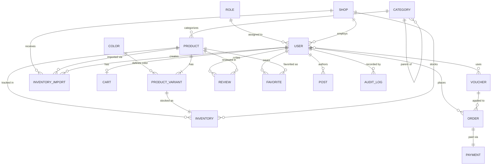

# Thiết kế Cơ sở dữ liệu — DaoDuckWear

## Tổng quan

DaoDuckWear sử dụng **MongoDB** với ODM **Mongoose 9**. Toàn bộ dữ liệu được tổ chức thành **18 collections**, chia thành 5 nhóm chức năng:

| Nhóm | Collections |
|---|---|
| Phân quyền & Người dùng | `roles`, `users`, `shops` |
| Danh mục & Sản phẩm | `categories`, `colors`, `products`, `product_variants` |
| Kho hàng | `inventories`, `inventory_imports` |
| Thương mại | `carts`, `vouchers`, `orders`, `payments` |
| Nội dung & Vận hành | `reviews`, `favorites`, `posts`, `audit_logs`, `banners` |

**Quy ước chung áp dụng cho tất cả collections:**

| Trường | Kiểu | Mô tả |
|---|---|---|
| `_id` | ObjectId | Khóa chính, tự sinh bởi MongoDB |
| `createdAt` | Date | Thời điểm tạo, tự điền bởi Mongoose timestamps |
| `updatedAt` | Date | Thời điểm cập nhật gần nhất |
| `deletedAt` | Date \| null | Soft delete — `null` = đang hoạt động, có giá trị = đã xóa mềm |

---

## Chi tiết Schema

### roles

Danh sách vai trò trong hệ thống. Mỗi user được gán một vai trò duy nhất. Vai trò không có phân cấp trong schema — logic kế thừa quyền được xử lý ở tầng Guard.

| Trường | Kiểu | Ràng buộc | Mô tả |
|---|---|---|---|
| `name` | string | required, unique | Tên vai trò. Giá trị mặc định: `USER`, `STAFF`, `MANAGER`, `ADMIN` |

---

### users

Tài khoản người dùng. Hỗ trợ đăng nhập local (email + password) và Google OAuth. Địa chỉ giao hàng được nhúng trực tiếp dưới dạng mảng subdocument.

| Trường | Kiểu | Ràng buộc | Mô tả |
|---|---|---|---|
| `username` | string | required, unique | Tên hiển thị |
| `email` | string | required, unique | Email đăng nhập |
| `password` | string \| null | optional | Hash bcrypt. `null` nếu đăng nhập qua Google |
| `provider` | enum | required | Nguồn tạo tài khoản: `local` \| `google` \| `facebook` |
| `avatar` | string \| null | optional | URL ảnh đại diện (Cloudinary) |
| `roleId` | ObjectId → roles | required | Vai trò của user |
| `shopId` | ObjectId → shops \| null | optional | Cửa hàng user thuộc về (STAFF, MANAGER). `null` nếu là USER hoặc ADMIN |
| `isVerified` | boolean | default: false | Đã xác thực email chưa |
| `isLocked` | boolean | default: false | Tài khoản bị khóa (admin tắt thủ công) |
| `gender` | enum \| null | optional | `male` \| `female` \| `other` |
| `addresses` | Address[] | default: [] | Mảng địa chỉ giao hàng nhúng (xem subdocument bên dưới) |

**Subdocument Address:**

| Trường | Kiểu | Mô tả |
|---|---|---|
| `address` | string | Địa chỉ đầy đủ |
| `phone` | string | Số điện thoại liên hệ |

---

### shops

Cửa hàng/chi nhánh trong hệ thống. Mỗi cửa hàng có đội ngũ nhân viên (STAFF, MANAGER) và quản lý kho hàng riêng.

| Trường | Kiểu | Ràng buộc | Mô tả |
|---|---|---|---|
| `name` | string | required | Tên cửa hàng |
| `slug` | string \| null | unique, sparse | Slug URL |
| `wardCode` | number | required | Mã phường/xã (dùng để tính phí vận chuyển) |
| `cityCode` | number | required | Mã tỉnh/thành phố |

---

### categories

Danh mục sản phẩm hỗ trợ **đệ quy nhiều cấp** — một category có thể là con của category khác thông qua `parentId`.

| Trường | Kiểu | Ràng buộc | Mô tả |
|---|---|---|---|
| `name` | string | required | Tên danh mục |
| `slug` | string | required, unique | Slug URL |
| `parentId` | ObjectId → categories \| null | optional | Danh mục cha. `null` = danh mục gốc |

---

### colors

Bảng màu dùng để gán màu sắc cho `product_variants`. Mỗi màu có mã hex để hiển thị trực quan.

| Trường | Kiểu | Ràng buộc | Mô tả |
|---|---|---|---|
| `name` | string | required, unique | Tên màu (VD: "Đỏ") |
| `slug` | string | required, unique | Slug (VD: "do") |
| `hexCode` | string | required, unique | Mã màu hex (VD: "#FF0000") |

---

### products

Sản phẩm chính. Một product là "template" — giá, size, màu sắc cụ thể nằm ở `product_variants`. Ảnh sản phẩm được nhúng trực tiếp dưới dạng mảng.

| Trường | Kiểu | Ràng buộc | Mô tả |
|---|---|---|---|
| `name` | string | required | Tên sản phẩm |
| `slug` | string | required, unique | Slug URL |
| `description` | string \| null | optional | Mô tả HTML/Markdown |
| `basePrice` | number | required | Giá cơ sở (dùng khi variant không override giá) |
| `categoryId` | ObjectId → categories | required | Danh mục |
| `status` | string | default: `active` | Trạng thái: `active` \| `inactive` |
| `images` | ProductImage[] | default: [] | Mảng ảnh nhúng (xem subdocument bên dưới) |

**Subdocument ProductImage:**

| Trường | Kiểu | Mô tả |
|---|---|---|
| `url` | string | URL Cloudinary |
| `publicId` | string | ID Cloudinary để xóa ảnh |
| `color` | string \| null | Màu tương ứng với ảnh này |
| `isMain` | boolean | Ảnh chính của sản phẩm |
| `isThumbnail` | boolean | Ảnh thumbnail |

---

### product_variants

Biến thể cụ thể của sản phẩm (size + màu). SKU là định danh duy nhất của mỗi biến thể.

**Format SKU:** `[BrandPrefix][TypePrefix][Day][Warehouse] - [Size] - [ColorCode]`
Ví dụ: `UNLE15HCM - S - H`

| Trường | Kiểu | Ràng buộc | Mô tả |
|---|---|---|---|
| `productId` | ObjectId → products | required | Sản phẩm gốc |
| `size` | string \| null | optional | Kích thước (VD: S, M, L, XL) |
| `color` | string \| null | optional | Tên màu (text) |
| `colorHexId` | ObjectId → colors \| null | optional | Tham chiếu màu sang bảng colors |
| `sku` | string | required, unique | Mã SKU duy nhất |
| `price` | number \| null | optional | Giá riêng của variant. `null` = dùng `basePrice` từ product |
| `image` | string \| null | optional | URL ảnh riêng cho variant này |

---

### inventories

Tồn kho theo từng cửa hàng và từng variant. `reservedQuantity` là số lượng đang được "giữ chỗ" bởi các đơn hàng PENDING — chưa trừ khỏi kho thật.

**Index unique:** `(shopId, variantId)` — mỗi shop chỉ có 1 bản ghi tồn kho cho mỗi variant.

| Trường | Kiểu | Ràng buộc | Mô tả |
|---|---|---|---|
| `shopId` | ObjectId → shops | required | Cửa hàng |
| `productId` | ObjectId → products | required | Sản phẩm (denormalized để query nhanh) |
| `variantId` | ObjectId → product_variants | required | Biến thể |
| `quantity` | number | required, min: 0 | Tồn kho thực tế |
| `reservedQuantity` | number | default: 0, min: 0 | Số lượng đang giữ chỗ cho đơn hàng PENDING |

> **Số lượng có thể mua thực tế** = `quantity - reservedQuantity`

---

### inventory_imports

Lịch sử nhập kho. Mỗi lần nhập hàng tạo một bản ghi. Hỗ trợ **thu hồi phiếu nhập** (REVOKED) — khi thu hồi sẽ trừ lại số lượng đã nhập.

| Trường | Kiểu | Ràng buộc | Mô tả |
|---|---|---|---|
| `shopId` | ObjectId → shops | required | Cửa hàng nhập hàng |
| `productId` | ObjectId → products | required | Sản phẩm (denormalized) |
| `createdBy` | ObjectId → users | required | Người tạo phiếu nhập |
| `items` | ImportItem[] | required | Danh sách variant và số lượng nhập (xem bên dưới) |
| `totalQuantity` | number | required | Tổng số lượng nhập |
| `status` | enum | default: `ACTIVE` | `ACTIVE` \| `REVOKED` |
| `revokedBy` | ObjectId → users \| null | optional | Người thu hồi |
| `revokedAt` | Date \| null | optional | Thời điểm thu hồi |
| `note` | string \| null | optional | Ghi chú |

**Subdocument ImportItem:**

| Trường | Kiểu | Mô tả |
|---|---|---|
| `variantId` | ObjectId | Biến thể được nhập |
| `quantity` | number | Số lượng nhập |
| `sku` | string | SKU tại thời điểm nhập (snapshot) |

---

### carts

Giỏ hàng của user. Mỗi user có tối đa 1 giỏ hàng (`userId` là unique). Các items được nhúng trực tiếp.

| Trường | Kiểu | Ràng buộc | Mô tả |
|---|---|---|---|
| `userId` | ObjectId → users | required, unique | Chủ giỏ hàng |
| `items` | CartItem[] | default: [] | Danh sách sản phẩm trong giỏ (xem bên dưới) |

**Subdocument CartItem:**

| Trường | Kiểu | Mô tả |
|---|---|---|
| `variantId` | ObjectId | Biến thể sản phẩm |
| `shopId` | ObjectId | Cửa hàng (dùng để lấy tồn kho đúng shop) |
| `quantity` | number | Số lượng |

---

### vouchers

Mã giảm giá. Hỗ trợ 2 kiểu giảm: phần trăm (`PERCENTAGE`) và số tiền cố định (`FIXED`). Tracking danh sách user đã dùng qua `usedByUsers`.

| Trường | Kiểu | Ràng buộc | Mô tả |
|---|---|---|---|
| `code` | string | required, unique | Mã voucher (uppercase, trimmed khi lưu) |
| `discountType` | enum | required | `PERCENTAGE` \| `FIXED` |
| `discountValue` | number | required | Giá trị giảm (% hoặc VNĐ tùy type) |
| `minOrderValue` | number \| null | optional | Giá trị đơn hàng tối thiểu để áp dụng |
| `maxDiscountAmount` | number \| null | optional | Giảm tối đa (chỉ có nghĩa với `PERCENTAGE`) |
| `usageLimit` | number \| null | optional | Giới hạn tổng số lần dùng. `null` = không giới hạn |
| `usedCount` | number | default: 0 | Số lần đã dùng |
| `usedByUsers` | ObjectId[] → users | default: [] | Danh sách user đã sử dụng voucher này |
| `expiredAt` | Date \| null | optional | Ngày hết hạn. `null` = không giới hạn thời gian |

**Trạng thái voucher (tính toán runtime, không lưu DB):**

| Trạng thái | Điều kiện |
|---|---|
| `ACTIVE` | Chưa hết hạn + còn lượt dùng |
| `EXPIRED` | `expiredAt <= now` |
| `USED_UP` | `usedCount >= usageLimit` |
| `DELETED` | `deletedAt != null` |

---

### orders

Đơn hàng. Thông tin sản phẩm (`items`) được lưu dưới dạng **snapshot** tại thời điểm đặt hàng — giá và tên sản phẩm được ghi cố định, không bị ảnh hưởng khi sản phẩm thay đổi sau này.

| Trường | Kiểu | Ràng buộc | Mô tả |
|---|---|---|---|
| `orderCode` | string | required, unique | Mã đơn hàng (tự sinh) |
| `userId` | ObjectId → users \| null | optional | `null` nếu đặt hàng không cần đăng nhập |
| `shippingAddress` | ShippingAddress | required | Địa chỉ giao hàng (xem subdocument bên dưới) |
| `items` | OrderItemSnapshot[] | required | Danh sách sản phẩm (snapshot, xem bên dưới) |
| `totalAmount` | number | required | Tổng tiền hàng trước giảm giá |
| `shippingFee` | number | default: 0 | Phí vận chuyển |
| `voucherCode` | string \| null | optional | Mã voucher đã áp dụng |
| `discountAmount` | number | default: 0 | Số tiền giảm từ voucher |
| `finalTotal` | number | required | Tổng thanh toán cuối cùng |
| `status` | enum | default: `PENDING` | `PENDING` \| `CONFIRMED` \| `SHIPPING` \| `COMPLETED` \| `CANCELLED` |
| `paymentMethod` | enum | required | `COD` \| `BANK_TRANSFER` \| `VNPAY` \| `MOMO` |
| `paymentStatus` | enum | default: `UNPAID` | `UNPAID` \| `PAID` \| `REFUNDED` |
| `paidAt` | Date \| null | optional | Thời điểm thanh toán thành công |

**Subdocument ShippingAddress:**

| Trường | Kiểu | Mô tả |
|---|---|---|
| `fullName` | string | Tên người nhận |
| `email` | string | Email liên hệ |
| `phone` | string | Số điện thoại |
| `province` | string | Tỉnh/thành phố |
| `ward` | string | Phường/xã |
| `address` | string | Địa chỉ chi tiết |
| `note` | string \| null | Ghi chú giao hàng |

**Subdocument OrderItemSnapshot:**

| Trường | Kiểu | Mô tả |
|---|---|---|
| `productId` | ObjectId | Tham chiếu sản phẩm |
| `variantId` | ObjectId | Tham chiếu biến thể |
| `shopId` | ObjectId | Cửa hàng |
| `name` | string | Tên sản phẩm tại thời điểm đặt |
| `image` | string | Ảnh tại thời điểm đặt |
| `size` | string | Size tại thời điểm đặt |
| `color` | string | Màu tại thời điểm đặt |
| `price` | number | Giá tại thời điểm đặt |
| `quantity` | number | Số lượng |

---

### payments

Thông tin thanh toán gắn với đơn hàng. Quan hệ **1-1** với `orders`.

| Trường | Kiểu | Ràng buộc | Mô tả |
|---|---|---|---|
| `orderId` | ObjectId → orders | required, unique | Đơn hàng tương ứng |
| `method` | string \| null | optional | Phương thức thanh toán |
| `amount` | number | required | Số tiền thanh toán |
| `status` | enum | default: `PENDING` | `PENDING` \| `SUCCESS` \| `FAILED` |
| `transactionId` | string \| null | optional | Mã giao dịch từ cổng thanh toán |

---

### reviews

Đánh giá sản phẩm của khách hàng. Rating từ 1–5 sao.

| Trường | Kiểu | Ràng buộc | Mô tả |
|---|---|---|---|
| `userId` | ObjectId → users \| null | optional | Người viết đánh giá |
| `productId` | ObjectId → products \| null | optional | Sản phẩm được đánh giá |
| `rating` | number \| null | optional, min: 1, max: 5 | Điểm đánh giá |
| `comment` | string \| null | optional | Nội dung nhận xét |

---

### favorites

Danh sách sản phẩm yêu thích của user. **Index unique** `(userId, productId)` đảm bảo không thể lưu trùng.

| Trường | Kiểu | Ràng buộc | Mô tả |
|---|---|---|---|
| `userId` | ObjectId → users | required | User |
| `productId` | ObjectId → products | required | Sản phẩm được yêu thích |

---

### posts

Bài viết / blog của hệ thống (tin tức, lookbook, hướng dẫn phối đồ...).

| Trường | Kiểu | Ràng buộc | Mô tả |
|---|---|---|---|
| `title` | string | required | Tiêu đề bài viết |
| `slug` | string | required, unique | Slug URL |
| `content` | string \| null | optional | Nội dung HTML/Markdown |
| `authorId` | ObjectId → users \| null | optional | Tác giả |

---

### audit_logs

Nhật ký hành động của người dùng trong hệ thống. Ghi lại toàn bộ thao tác thay đổi dữ liệu. `oldData` và `newData` lưu snapshot trước/sau để hỗ trợ audit.

| Trường | Kiểu | Ràng buộc | Mô tả |
|---|---|---|---|
| `userId` | ObjectId → users \| null | optional | Người thực hiện hành động |
| `action` | string | required | Loại hành động (VD: `CREATE_PRODUCT`, `UPDATE_ORDER`) |
| `entityName` | string | required | Tên collection bị tác động (VD: `products`, `orders`) |
| `entityId` | ObjectId \| null | optional | ID của bản ghi bị tác động |
| `oldData` | object \| null | optional | Dữ liệu trước khi thay đổi |
| `newData` | object \| null | optional | Dữ liệu sau khi thay đổi |

---

### banners

Banner quảng cáo hiển thị trên website. Hỗ trợ nhiều vị trí (`position`) trên nhiều trang (`page`), với thời gian hiển thị có thể lên lịch.

| Trường | Kiểu | Ràng buộc | Mô tả |
|---|---|---|---|
| `title` | string | required | Tiêu đề banner |
| `imageUrl` | string | required | URL ảnh desktop (Cloudinary) |
| `publicId` | string | required | ID Cloudinary của ảnh desktop |
| `mobileImageUrl` | string \| null | optional | URL ảnh mobile (responsive) |
| `mobilePublicId` | string \| null | optional | ID Cloudinary ảnh mobile |
| `linkUrl` | string \| null | optional | URL khi click vào banner |
| `page` | string | required | Trang hiển thị: `home` \| `login` \| `shop` \| ... |
| `position` | string | required | Vị trí: `hero` \| `sidebar` \| `footer` \| `popup` |
| `sortOrder` | number | default: 0 | Thứ tự hiển thị khi có nhiều banner cùng vị trí |
| `isActive` | boolean | default: true | Đang bật hay tắt |
| `startAt` | Date \| null | optional | Thời điểm bắt đầu hiển thị |
| `endAt` | Date \| null | optional | Thời điểm ngừng hiển thị |

---

## Mối quan hệ giữa các Collections



---

## Quyết định thiết kế quan trọng

### 1. Soft Delete
Hầu hết các collections sử dụng soft delete thay vì xóa vật lý. Bản ghi bị "xóa" khi `deletedAt` được gán giá trị `new Date()`. Tất cả query phải kèm điều kiện `{ deletedAt: null }` để lọc bản ghi còn hoạt động.

```
// Truy vấn chuẩn
Model.find({ deletedAt: null })

// Xóa mềm
doc.deletedAt = new Date()
await doc.save()
```

### 2. Order Items là Snapshot
`orders.items` lưu **bản sao thông tin sản phẩm** (tên, giá, màu, size) tại thời điểm đặt hàng — không phải ObjectId reference. Điều này đảm bảo lịch sử đơn hàng không bị thay đổi khi admin cập nhật thông tin sản phẩm sau này.

### 3. Inventory Reservation
Khi đơn hàng được tạo, số lượng được tăng vào `reservedQuantity` thay vì trừ ngay khỏi `quantity`. Số lượng thực trừ chỉ khi đơn hàng chuyển sang `COMPLETED`. Khi đơn hàng bị `CANCELLED`, `reservedQuantity` được giải phóng bởi background job `release-reserved-stock`.

```
// Số lượng có thể mua
available = quantity - reservedQuantity
```

### 4. Denormalization trong Inventory
`inventories` lưu cả `productId` dù đã có thể join qua `variantId → product_variants → productId`. Đây là denormalization có chủ đích để tránh lookup 2 bước khi query tồn kho theo sản phẩm.

### 5. Voucher Usage Tracking
`vouchers.usedByUsers` là mảng ObjectId của tất cả user đã dùng voucher. Dùng để kiểm tra "user này đã dùng voucher chưa" mà không cần query collection khác.

### 6. Cart là Document Nhúng
`carts.items` là mảng nhúng thay vì collection riêng. Phù hợp vì cart luôn được đọc/ghi toàn bộ cùng một lúc, không cần query item độc lập.

---

## Source files

| Collection | Schema file |
|---|---|
| `roles` | `apps/backend/src/modules/roles/schemas/role.schema.ts` |
| `users` | `apps/backend/src/modules/users/schemas/user.schema.ts` |
| `shops` | `apps/backend/src/modules/shops/schemas/shop.schema.ts` |
| `categories` | `apps/backend/src/modules/categories/schemas/category.schema.ts` |
| `colors` | `apps/backend/src/modules/colors/schemas/color.schema.ts` |
| `products` | `apps/backend/src/modules/products/schemas/product.schema.ts` |
| `product_variants` | `apps/backend/src/modules/products/schemas/product-variant.schema.ts` |
| `inventories` | `apps/backend/src/modules/inventory/schemas/inventory.schema.ts` |
| `inventory_imports` | `apps/backend/src/modules/inventory/schemas/inventory-import.schema.ts` |
| `carts` | `apps/backend/src/modules/cart/schemas/cart.schema.ts` |
| `vouchers` | `apps/backend/src/modules/vouchers/schemas/voucher.schema.ts` |
| `orders` | `apps/backend/src/modules/orders/schemas/order.schema.ts` |
| `payments` | `apps/backend/src/modules/payments/schemas/payment.schema.ts` |
| `reviews` | `apps/backend/src/modules/reviews/schemas/review.schema.ts` |
| `favorites` | `apps/backend/src/modules/favorites/schemas/favorite.schema.ts` |
| `posts` | `apps/backend/src/modules/posts/schemas/post.schema.ts` |
| `audit_logs` | `apps/backend/src/modules/audit-logs/schemas/audit-log.schema.ts` |
| `banners` | `apps/backend/src/modules/banners/schemas/banner.schema.ts` |
