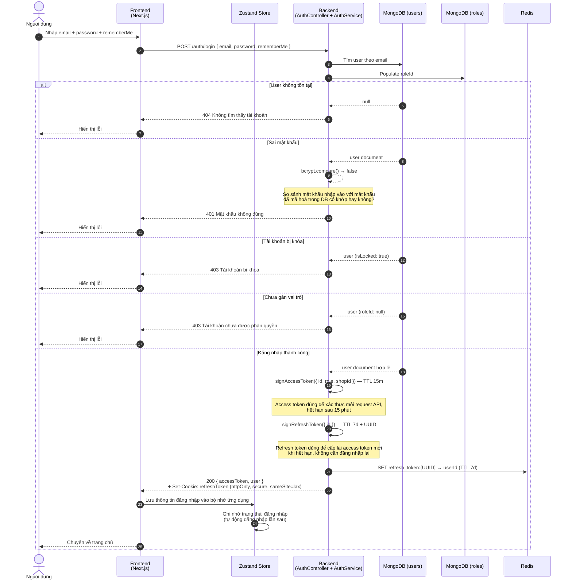

# Sequence Diagram — Login Flow (Email/Password)

## Actors

| Actor | Mô tả |
|-------|-------|
| Nguoi dung | Trình duyệt, nhập form đăng nhập |
| Frontend | Next.js App — login form + Axios + Zustand |
| Store | Zustand auth store (`stores/auth.store.ts`) |
| Backend | NestJS AuthController + AuthService |
| MongoDB (users) | Collection lưu tài khoản người dùng |
| MongoDB (roles) | Collection lưu vai trò (USER, ADMIN, ...) |
| Redis | Lưu refresh token với TTL |

## Diagram

## Source code liên quan

| File | Vai trò |
|------|---------|
| `apps/backend/src/modules/auth/auth.controller.ts` | Endpoint `POST /auth/login`, set cookie |
| `apps/backend/src/modules/auth/auth.service.ts` | Validate, sign token, lưu Redis |
| `apps/backend/src/common/utils/jwt.util.ts` | `signAccessToken()`, `signRefreshToken()` |
| `apps/frontend/apis/auth.api.ts` | Gọi API login |
| `apps/frontend/stores/auth.store.ts` | `setAuth()`, `hasSession` localStorage |
