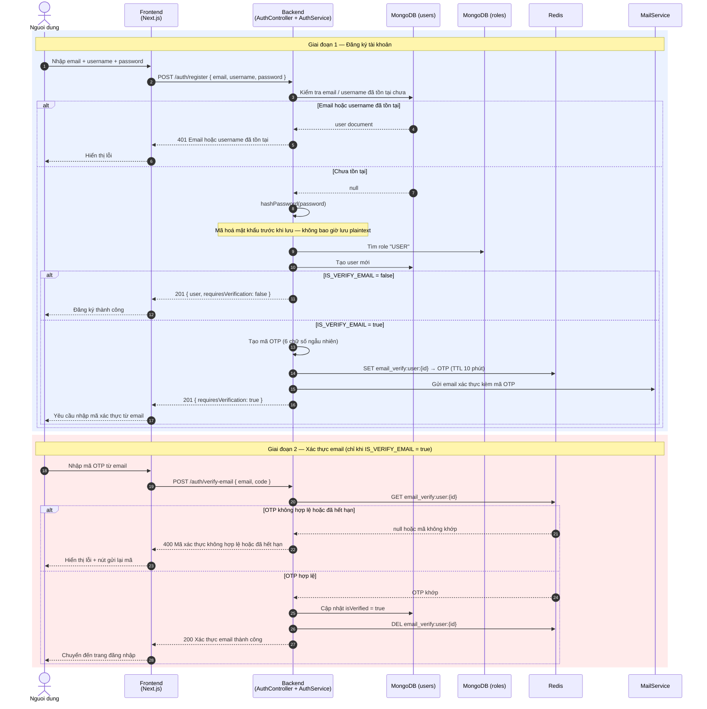

# Sequence Diagram — Register Flow (Email/Password)

## Actors

| Actor | Mô tả |
|-------|-------|
| Nguoi dung | Trình duyệt, nhập form đăng ký |
| Frontend | Next.js App — register form + Axios |
| Backend | NestJS AuthController + AuthService |
| MongoDB (users) | Collection lưu tài khoản người dùng |
| MongoDB (roles) | Collection lưu vai trò (USER, ADMIN, ...) |
| Redis | Lưu OTP xác thực email (TTL 10 phút) |
| MailService | Gửi email chứa mã OTP |

## Ghi chú

- **Giai đoạn 2 chỉ xảy ra** khi biến môi trường `IS_VERIFY_EMAIL=true`
- Mã OTP có hiệu lực **10 phút** — hết hạn cần dùng `POST /auth/resend-verify-email` để gửi lại
- Tài khoản tạo với `isVerified: false` sẽ **không đăng nhập được** cho đến khi xác thực

## Diagram

## Source code liên quan

| File | Vai trò |
|------|---------|
| `apps/backend/src/modules/auth/auth.controller.ts` | Endpoints `POST /auth/register`, `/verify-email`, `/resend-verify-email` |
| `apps/backend/src/modules/auth/auth.service.ts` | `register()`, `verifyEmail()`, `resendVerifyEmail()`, `sendOtp()` |
| `apps/backend/src/common/utils/password.util.ts` | `hashPassword()` |
| `apps/backend/src/modules/mail/mail.service.ts` | `sendVerifyEmail()` |
