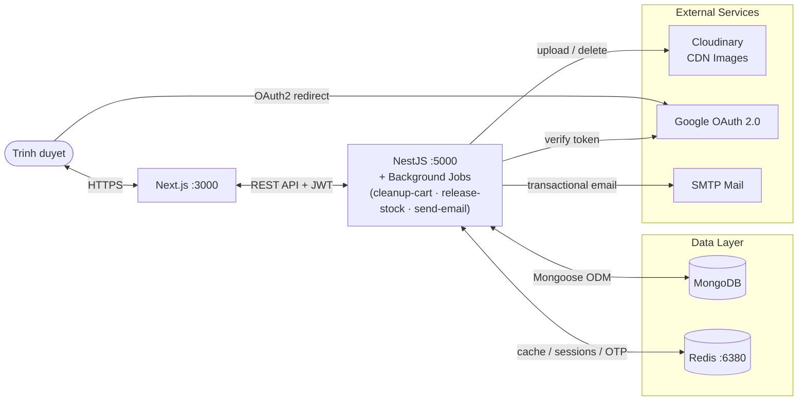

# System Architecture — DaoDuckWear

## Tổng quan

DaoDuckWear là monorepo gồm 2 app độc lập: **Next.js** (frontend) và **NestJS** (backend), giao tiếp qua REST API với JWT. Backend kết nối MongoDB làm database chính, Redis cho cache/session, và 3 external services: Cloudinary, Google OAuth, SMTP Mail.

## Diagram

## Các thành phần

| Thành phần | Công nghệ | Vai trò |
|---|---|---|
| **Frontend** | Next.js 16, React 19, Tailwind CSS 4 | Giao diện người dùng, SSR + ISR |
| **Backend** | NestJS 11, TypeScript | REST API, business logic, auth |
| **MongoDB** | Mongoose 9 ODM | Database chính — products, orders, users... |
| **Redis** | ioredis, Docker :6380 | JWT refresh tokens, OTP TTL, rate limiting, cache |
| **Cloudinary** | cloudinary v2 SDK | Upload và lưu trữ ảnh sản phẩm, avatar, banner |
| **Google OAuth 2.0** | google-auth-library | Đăng nhập bằng tài khoản Google |
| **SMTP Mail** | Nodemailer + @nestjs-modules/mailer | Gửi email xác thực, OTP, thông báo đơn hàng |

## Frontend — Route Groups

| Route group | Mục đích | Guard |
|---|---|---|
| `(app)` | Storefront — trang chủ, sản phẩm, giỏ hàng, checkout | Public |
| `(admin)` | Admin panel — quản lý sản phẩm, đơn hàng, vouchers... | AuthGuard + RoleGuard (ADMIN/STAFF/MANAGER) |
| `(auth)` | Đăng nhập, đăng ký, đặt lại mật khẩu | GuestGuard |
| `(user)` | Hồ sơ cá nhân, lịch sử đơn hàng, yêu thích | AuthGuard |

## Backend — Background Jobs

| Job | Mục đích |
|---|---|
| `cleanup-cart.job` | Dọn dẹp cart hết hạn |
| `release-reserved-stock.job` | Giải phóng tồn kho đang giữ chỗ (đơn hàng bị hủy/hết giờ) |
| `send-email.job` | Gửi email bất đồng bộ |

## Source files

| File | Vai trò |
|---|---|
| `apps/frontend/` | Toàn bộ Next.js app |
| `apps/backend/src/main.ts` | Bootstrap NestJS, CORS, global pipes/interceptors |
| `apps/backend/src/app.module.ts` | Root module — import toàn bộ feature modules |
| `apps/backend/src/modules/` | 16+ feature modules (auth, products, orders...) |
| `apps/backend/src/jobs/` | Background jobs |
| `docker-compose.yml` | Khởi động Redis container |
