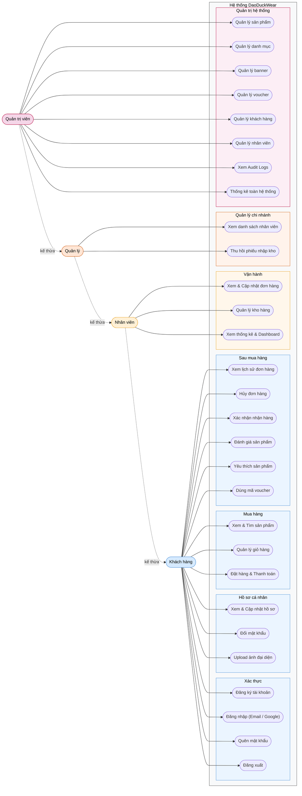

# Use Case Diagram — Tổng quát DaoDuckWear

## Actors

| Actor | Role DB | Mô tả |
|-------|---------|-------|
| Khách hàng | `USER` | Người dùng đã đăng ký — mua hàng, quản lý đơn, đánh giá |
| Nhân viên | `STAFF` | Xử lý đơn hàng, nhập kho, xem thống kê chi nhánh |
| Quản lý | `MANAGER` | Mọi quyền của Nhân viên + xem nhân sự, thu hồi phiếu kho |
| Quản trị viên | `ADMIN` | Toàn quyền hệ thống |

> Quan hệ kế thừa: Nhân viên ⊃ Khách hàng · Quản lý ⊃ Nhân viên · Quản trị viên ⊃ Quản lý

## Diagram

## Nhóm chức năng

| Màu nền | Nhóm | Use Cases |
|---------|------|-----------|
| Xanh dương | Xác thực + Hồ sơ + Mua hàng + Sau mua | UC1 – UC16 (Khách hàng) |
| Cam vàng | Vận hành | UC17 – UC19 (Nhân viên) |
| Cam đậm | Quản lý chi nhánh | UC20 – UC21 (Quản lý) |
| Hồng đỏ | Quản trị hệ thống | UC22 – UC29 (Quản trị viên) |

## Source code liên quan

| File | Vai trò |
|------|---------|
| `apps/backend/src/modules/auth/auth.controller.ts` | UC1–UC4, UC6 |
| `apps/backend/src/modules/users/users.controller.ts` | UC5, UC7, UC20, UC26, UC27 |
| `apps/backend/src/modules/products/products.controller.ts` | UC8, UC22 |
| `apps/backend/src/modules/cart/cart.controller.ts` | UC9 |
| `apps/backend/src/modules/orders/orders.controller.ts` | UC10–UC13, UC17 |
| `apps/backend/src/modules/reviews/reviews.controller.ts` | UC14 |
| `apps/backend/src/modules/favorites/favorites.controller.ts` | UC15 |
| `apps/backend/src/modules/vouchers/vouchers.controller.ts` | UC16, UC25 |
| `apps/backend/src/modules/inventory/inventory.controller.ts` | UC18, UC21 |
| `apps/backend/src/modules/analytics/analytics.controller.ts` | UC19, UC29 |
| `apps/backend/src/modules/categories/categories.controller.ts` | UC23 |
| `apps/backend/src/modules/banners/banners.controller.ts` | UC24 |
| `apps/backend/src/modules/audit-logs/audit-logs.controller.ts` | UC28 |
