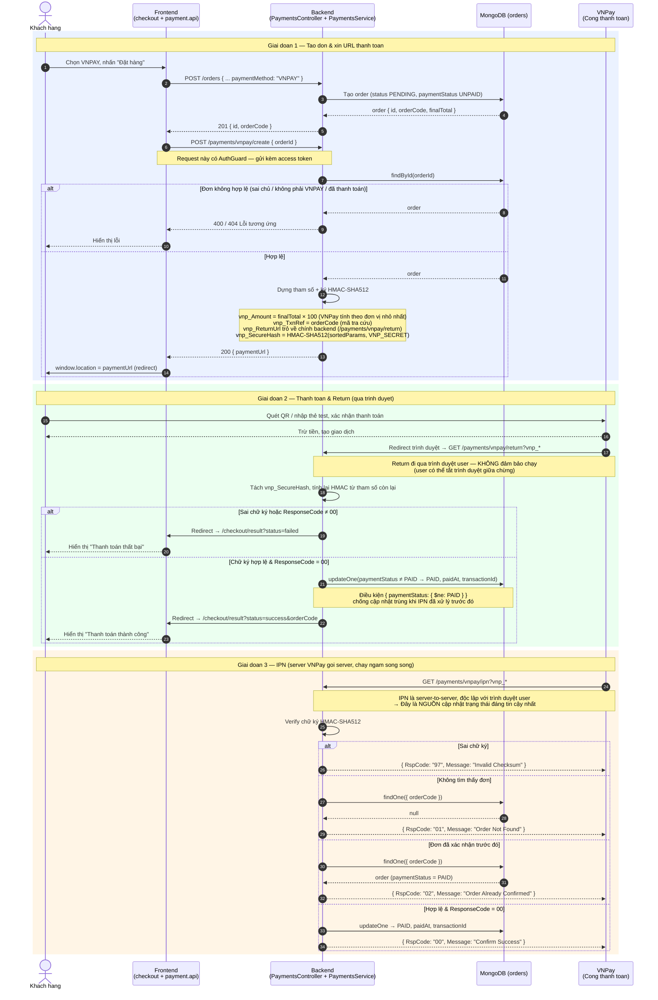

# Sequence Diagram — Thanh toán đơn hàng qua VNPay

## Actors

| Actor | Mô tả |
|-------|-------|
| Khách hàng | Chọn phương thức VNPAY tại trang checkout và thực hiện thanh toán |
| VNPay | Cổng thanh toán bên thứ ba — xử lý giao dịch, gọi Return + IPN về hệ thống |

## Tổng quan

Luồng VNPay gồm **3 giai đoạn**, trong đó Return (qua trình duyệt) và IPN (server-to-server) chạy **song song** và đều cập nhật trạng thái đơn hàng:

- **Return** — hiển thị kết quả cho người dùng xem, nhưng không đảm bảo chạy (user có thể tắt trình duyệt).
- **IPN** — VNPay chủ động gọi server, là **nguồn cập nhật đáng tin cậy nhất**.

Cả hai đều **bắt buộc verify chữ ký HMAC-SHA512** trước khi tin dữ liệu, vì query string có thể bị giả mạo. Việc cập nhật đơn dùng điều kiện `paymentStatus: { $ne: PAID }` để **chống cập nhật trùng** khi cả Return và IPN cùng xử lý.

## Diagram

## Source code liên quan

| File | Vai trò |
|------|---------|
| `apps/frontend/app/(app)/checkout/page.tsx` | Trang checkout — chọn VNPAY, tạo order rồi redirect sang VNPay |
| `apps/frontend/app/(app)/checkout/result/page.tsx` | Trang hiển thị kết quả thanh toán (success / failed) |
| `apps/frontend/apis/payment.api.ts` | Axios wrapper gọi `POST /payments/vnpay/create` |
| `apps/backend/src/modules/payments/payments.controller.ts` | 3 endpoint: create (có AuthGuard), return (redirect), ipn (server-to-server) |
| `apps/backend/src/modules/payments/payments.service.ts` | Build URL ký HMAC-SHA512, verify checksum Return & IPN, cập nhật order |
| `apps/backend/src/modules/orders/schemas/order.schema.ts` | Schema order — chứa `paymentStatus`, `paidAt`, `transactionId` |

## Ghi chú kỹ thuật

| Khái niệm | Giải thích |
|-----------|-----------|
| `vnp_Amount × 100` | VNPay nhận số tiền theo đơn vị nhỏ nhất (không có phần thập phân), nên VND phải nhân 100 |
| `vnp_TxnRef` | Mã tham chiếu giao dịch — dùng `orderCode` để dễ tra cứu và liên kết ngược về đơn hàng |
| `vnp_ReturnUrl` | Phải trỏ về **backend** (không phải frontend) — backend verify checksum xong mới redirect tiếp sang frontend |
| HMAC-SHA512 | Băm tham số đã sắp xếp theo ASCII với `VNP_SECRET`. Chỉ bạn và VNPay biết secret → xác minh dữ liệu không bị giả mạo |
| `RspCode` (IPN) | Mã phản hồi chuẩn để VNPay biết server đã nhận; trả sai format → VNPay gọi lại nhiều lần |
| `$ne: PAID` | Điều kiện cập nhật idempotent — đảm bảo đơn không bị xử lý 2 lần khi Return và IPN cùng chạy |
